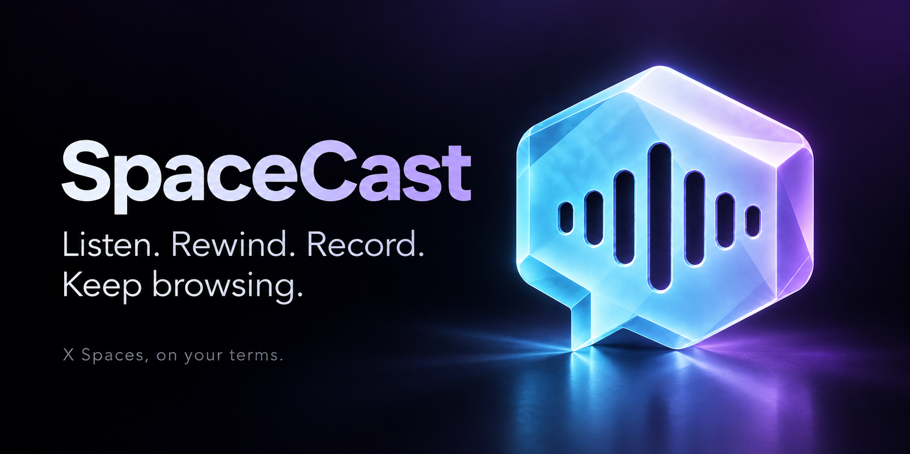
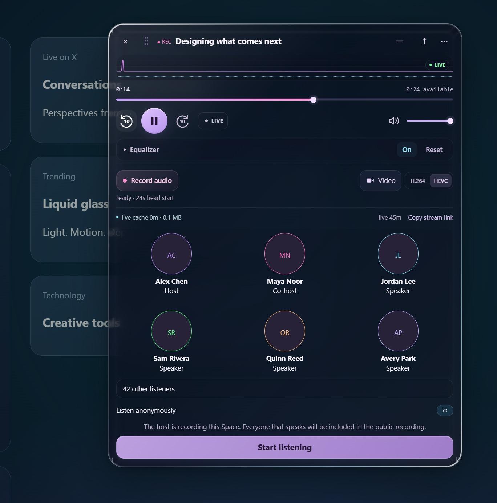
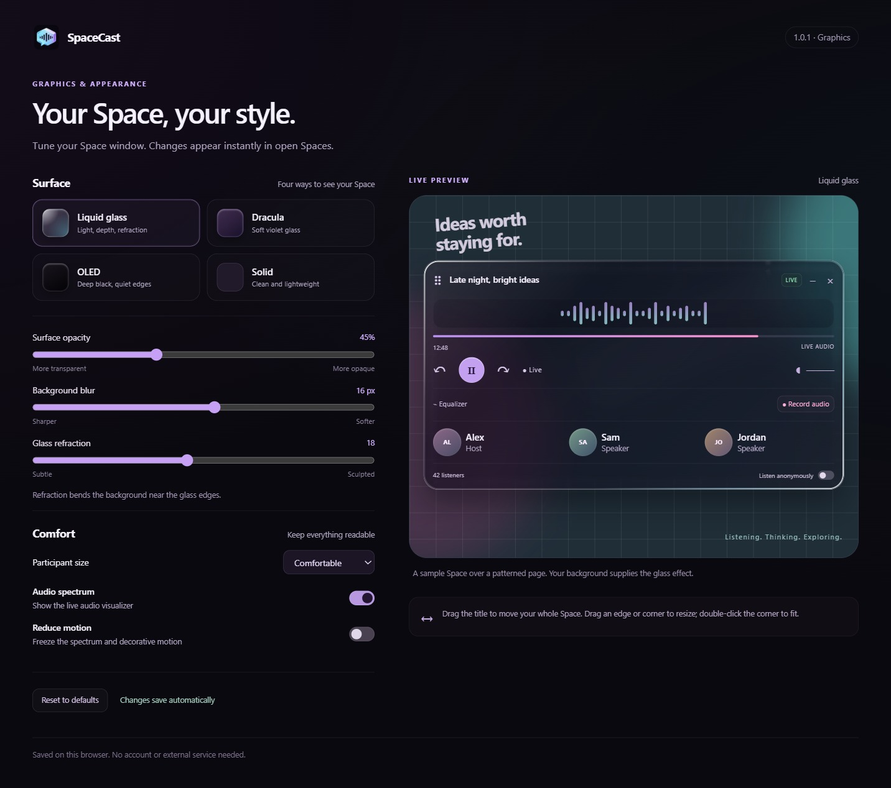

# SpaceCast

**Listen. Rewind. Record. Keep browsing.**

SpaceCast gives X Spaces a movable, resizable player with continuous live rewind, local recording, and customizable glass surfaces. The Space and its player stay together while you browse other pages on X.

> **Coming next:** The official SpaceCast release on the Chrome Web Store. Until then, install the unpacked extension using the steps below.

**[Download for Chrome / Edge](https://github.com/quiet-runtime/SpaceCast/releases/download/v1.0.4/SpaceCast-1.0.4-chrome.zip)** · [All downloads and release notes](https://github.com/quiet-runtime/SpaceCast/releases/latest)

## A closer look

**Your conversation, your controls.** Playback, live rewind, recording, and participants stay together in one movable window.



**Make it yours.** Choose Liquid glass, Dracula, OLED, or Solid, then tune the surface and accessibility settings.



*Screenshots show SpaceCast's actual interface rendered locally with fictional demonstration data. The banner is promotional artwork.*

## Features

- **Continuous rewind.** Audio keeps caching while playback is paused or you listen behind the live edge. Seek through the available audio or jump back to live.
- **Local audio recording.** Save live Spaces and available replays as Ogg Opus, with a source-stream fallback when encoding is unavailable. Pause a live recording, save a part, or stop and save.
- **One integrated window.** Move, resize, or minimize the Space without blocking the page behind it. Window position and size are remembered.
- **Listening controls.** Ten-second skip buttons, volume, a 16-band equalizer, and an audio spectrum.
- **Four visual styles.** Liquid glass, Dracula, OLED, and Solid, with opacity, blur, refraction, participant-size, and reduced-motion settings.
- **Optional video recording.** Capture the Space window on browsers that support reliable element or region capture. Codec availability depends on the browser and device.

## Install

### Chrome or Edge

1. [Download the Chrome / Edge ZIP](https://github.com/quiet-runtime/SpaceCast/releases/download/v1.0.4/SpaceCast-1.0.4-chrome.zip) and extract it into a folder you will keep.
2. Open `chrome://extensions` in Chrome or `edge://extensions` in Edge.
3. Enable **Developer mode**, choose **Load unpacked**, and select the folder containing `manifest.json`.
4. Refresh any open X tabs, then open a Space on [x.com](https://x.com).

To update, replace the files in that same folder, click **Reload** on the extension, and refresh X. Save any active recording first.

### Firefox — development build

[Download the unsigned Firefox development ZIP](https://github.com/quiet-runtime/SpaceCast/releases/download/v1.0.4/SpaceCast-1.0.4-firefox-development.zip) and extract it, or build it from the source folder:

```sh
npm run build:firefox
```

Open `about:debugging`, choose **This Firefox → Load Temporary Add-on**, and select `build/firefox/manifest.json`. An extracted Firefox package can be loaded through its own `manifest.json` instead.

The unsigned build is for [temporary installation](https://extensionworkshop.com/documentation/develop/temporary-installation-in-firefox/) and is removed when Firefox restarts. Normal distribution requires [Mozilla signing](https://extensionworkshop.com/documentation/publish/signing-and-distribution-overview/). Audio encoding, video capture, and glass effects may differ from Chromium browsers.

## Use

Open a live or recorded Space on X. SpaceCast adds its player to the Space window automatically; press **Play** if your browser requires a playback gesture.

If you are already listening to a Space through X, another Space's preview still gets the movable player and starts paused. Your existing listening session continues unchanged. X's own Join control and any account restrictions remain in place.

| Control | Action |
| --- | --- |
| Timeline / skip buttons | Seek within available audio or move ten seconds at a time |
| **Live** | Return to the current live edge |
| Title bar / move grip | Drag the entire Space window |
| Window edges and corners | Resize the window; double-click the bottom-right corner to restore automatic sizing |
| **−** | Minimize without ending playback |
| **Record audio** | Start recording with a short head start when buffered audio is available |
| Recording transport | Pause or resume, save the current part and continue, or stop and save |
| **Video** | Choose a capture source in the browser's sharing dialog and record the Space |
| Extension icon → **Graphics & appearance** | Change the visual style and comfort settings |

The move grip and resize corner also work with the keyboard: arrow keys adjust by 10 pixels, or 50 with Shift. Home resets position on the move grip or automatic sizing on the resize corner.

Browsing within X keeps the current session running. When X removes its own Space popup, SpaceCast retains the player and a **People · last seen** snapshot. Use **Open Space controls** to stop the extension player, finish saving any recording, and open X's controls in the same tab. **Start listening** hands playback to X and removes the extension player. Closing either extension presentation stops its audio; it does not leave another player behind.

## What to expect

- Rewind covers audio collected during the current session, subject to browser storage availability. It cannot recover live audio from before you opened the Space. A bounded memory cache is used if disk storage fails.
- A full page refresh, closing the tab, closing the player, or opening a different Space ends the current session. Save recordings before doing so; the cache is not a recording archive.
- Audio recording follows the source stream, independently of playback position, volume, and listening EQ. Rewinding the player does not rewind the recording. Opus output is transcoded audio, not a lossless copy of X's source.
- Replay saving depends on X making the replay available. X account access, stream availability, and changes to X's website can affect playback.
- Video requires a supported capture API and a source the browser can frame to the Space. If framing fails, video stops instead of recording the entire page.
- Only one Space is active per tab. Participant snapshots shown while browsing are not a live roster.

## Privacy

No SpaceCast account, analytics, or upload service is used. Settings, temporary audio, and saved recordings stay in your browser or on your device. Playing a Space still makes requests to X and its media services using the access available in your browser. See [PRIVACY.md](PRIVACY.md) for storage and permission details.

## Development

The extension uses plain JavaScript, CSS, and Manifest V3. Chrome and Edge load the source folder directly; no bundler or dependency installation is required. Development commands require Node.js 22 or newer.

```sh
npm test
npm run check
npm run build:chrome
npm run build:firefox
```

Tests cover stream requests, caching, recording startup, playback controls, appearance, window geometry, and navigation persistence. Browser integration also needs testing with an accessible Space and the target browser's actual recording capabilities.

## License

MIT licensed. See [LICENSE](LICENSE) and [THIRD_PARTY_NOTICES.md](THIRD_PARTY_NOTICES.md) for the copyright and bundled dependency notices.

Maintained by [Quiet Runtime](https://github.com/quiet-runtime). SpaceCast is an independent project and is not affiliated with X.
